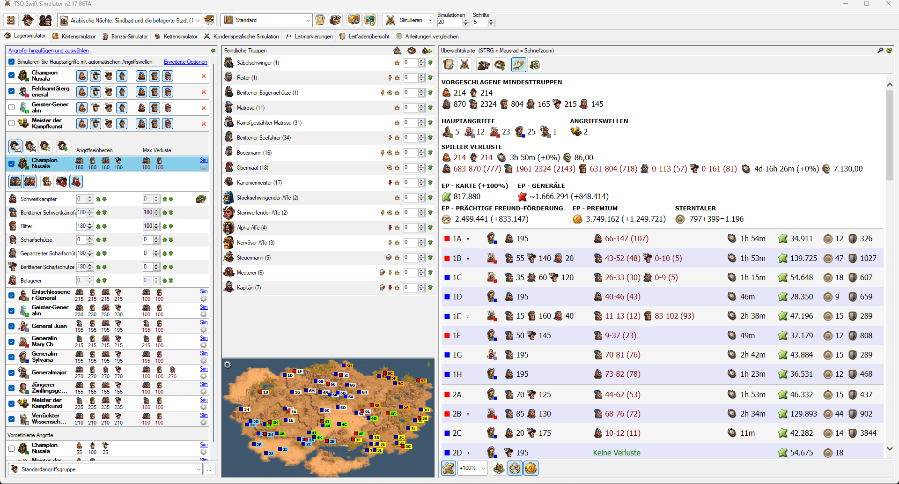

# TSO Swift Simulator


TSO Swift Simulator ist ein Community-Tool für Spieler von **Die Siedler Online (DSO)**, das entwickelt wurde, um Strategien zu simulieren, Truppenbewegungen zu planen und Abenteuer effizienter zu gestalten. Obwohl der ursprüngliche Entwickler nicht mehr aktiv ist, wird das Tool von der Community gepflegt und weiterentwickelt.


## Features
- **Abenteuer-Simulation**: Berechnung von Kampfausgängen und optimalen Truppenzusammenstellungen.
- **Benutzerfreundliches Interface**: Übersichtliche Darstellung von Ergebnissen und Taktikkarten.
- **Community-gepflegt**: Regelmäßige Updates durch engagierte Spieler und Fans.


## Installation
1. Lade das Repository herunter:
   ```bash
   git clone https://github.com/TSOWatch/TSO-Swift-Simulator.git
   cd TSO-Swift-Simulator
   ```
2. Stelle sicher, dass du die Abhängigkeiten (sofern vorhanden) installierst.
3. Starte das Tool gemäß der [Nutzungsanleitung](#nutzung).


## Nutzung
1. Öffne die ausführbare Datei oder starte das Tool über den Quellcode.
2. Wähle ein Abenteuer oder Szenario aus, das du simulieren möchtest.
3. Folge den Anweisungen auf dem Bildschirm, um deine Simulation durchzuführen.


## Versionskontrolle
Dieses Repository dient als zentrale Anlaufstelle für die Verwaltung von Versionen und Updates des Simulators. Änderungen und Verbesserungen werden über Pull Requests eingepflegt.

## Beiträge
Wir freuen uns über Beiträge der Community! So kannst du mithelfen:
- **Fehler melden**: Erstelle ein Issue.
- **Verbesserungen vorschlagen**: Erstelle ein Issue oder einen Pull Request.
- **Code beitragen**: Forke das Repository, nimm Änderungen vor und sende einen Pull Request.


## Danksagung
Ein besonderer Dank geht an die ursprünglichen Entwickler des TSO Swift Simulators der leider nicht zu erreichen ist!
